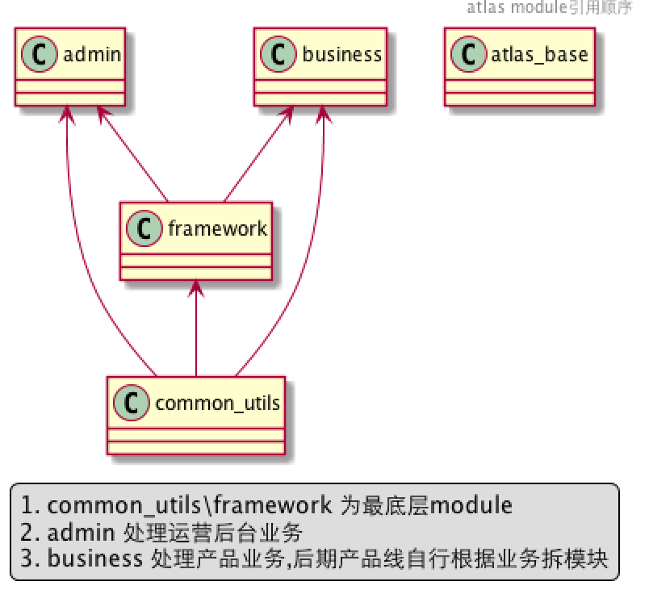

atlas_base
==========

atlas服务端基础框架

## 框架基于spring-boot
- jdbc
- redis
- mongo
- logback
- guava
- mybatis
- P6Spy
- java 8

## 结构说明
- admin 运营后台(spring-boot)
- business 业务接口(web\app) spring-boot项目
    - 全局Id生成器:IdGenerator,依赖mongo\redis
    - http接口调用:RestOperations
    - 持久层访问:mybatis
    - 分布式缓存:redistemplate(封装一层统一key,value的序列化反序列化)
    - nosql:mongodb
    - 本地缓存统一:guava cache,禁用全局static map结构
    - 类似collection判断是否为null,string是否为空统一,random等
    优先使用Apache common.lang3或者spring common或者guava,禁止重复早轮子
- common_utils 工具类,不依赖框架
- framework 封装的框架级代码,比如session等,仅依赖spring
- 整套框架是以spring为驱动的
- 依赖关系:
 

## TODO sso,统一认证系统;oauth
- 使用jwt代替https进行sso认证(反向代理服务无法缓存https,证书也难以维护)
    - jwt经常用于设计用户认证和授权系统(登陆\api)，甚至实现Web应用的单点登录。
    - oauth的实现
    - jjwt和auth0-jwt
    - http://blog.leapoahead.com/2015/09/06/understanding-jwt/ 
    

